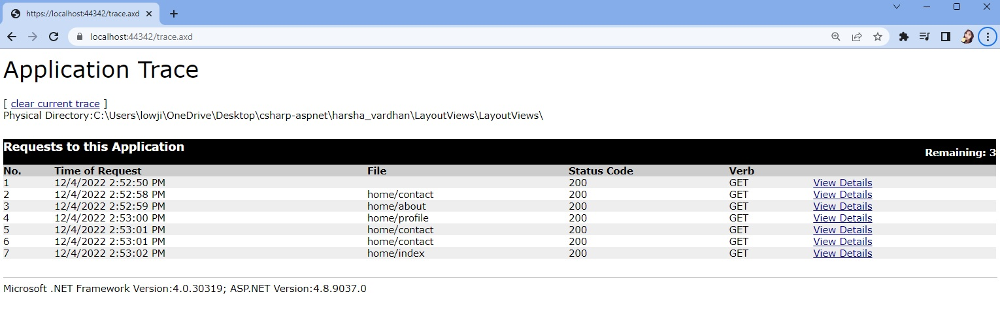

# Chapter 1 : Intro. to ASP.NET MVC

## What is ASP.NET MVC?

- ASP.NET MVC is a Web Application Framework, that gives you a powerful, MVC architecture-based way to build dynamic web applications that enables a clean separation of concerns that gives you full control over markup.
- Main Advantages:
  - Clean separation of concerns (develop model, view and controller independently)
  - Faster performance (no server controls required)

## What is MVC?

- MVC is an architectural pattern that dictates you to write the application code as composition of 3 major parts.
- Model
  - Data Structure
  - Business Logic
    - File or Database
- View
  - Presentation Logic
  - Reads data from Model
- Controller
  - Defines execution flow
  - Execution starts from controller
  - Fills data into model object
  - Pass model objects to view

## Why ASP.NET MVC?

- Advantages:
  - Supports Clean Separation of Concerns
  - Supports Unit Testing
  - Supports Dependency Injection
  - Supports Faster Performance than ASP.NET Web Forms.
  - No Page Life Cycle, Controls, Postback and ViewState.

## Controllers

- Controller is a class that defines execution flow in MVC application.
- Controller receives request from browser, call the model, call the view.

### Controllers - Development

- Controller is a class.
- Optionally, it is a public class.
- Controller should be inherited from `System.Web.Mvc.Controller` class.
- Controller's name should have suffix "Controller". E.g., "HomeController"

## Action Methods

- Executes when browser sends request.
- Performs action on database and returns result to users.

## ASP.NET MVC vs ASP.NET Web Forms

|                      ASP.NET MVC                      |                                              ASP.NET Web Forms                                              |
| :---------------------------------------------------: | :---------------------------------------------------------------------------------------------------------: |
|        Supports clean separation of concerns.         |                 Presentation Logic (.aspx) and Event Logic (.aspx.cs) are tightly coupled.                  |
| Business logic layer, Controllers are unit testable.  |                       Presentation Logic and Application Logic are not unit testable.                       |
|            Supports Dependency Injection.             |                                    Doesn't support dependency injection.                                    |
|                  Faster performance                   |                                             Slower performance                                              |
| No page life cycle, controls, postback and ViewState. |                         Supports page life cycle, controls, postback and ViewState.                         |
|  Runs based on the principle of "Web is stateless".   | Hides the "stateless nature of web" and tries to mask the developers as they are in "stateful" environment. |

## Folder Structure of MVC App

|   Project Folder    |                                          Description                                           |
| :-----------------: | :--------------------------------------------------------------------------------------------: |
|    `\App_Start`     |               Contains the files that needs to be executed on the first request.               |
|     `\App_Data`     |                          Contains SQL Server LocalDb Database Files.                           |
|   `\Controllers`    |                                   Contains all controllers.                                    |
|      `\Models`      |                                      Contains all models                                       |
|      `\Views`       |                                       Contains all views                                       |
| `\Views\web.config` |                         Contains configuration settings for all views.                         |
|   `\Global.asax`    |                      Contains application level and session level events.                      |
| `\packages.config`  |            Contains the list of NuGet packages currently installed in the project.             |
|    `\Web.config`    | Contains web application configuration settings, that needs to be initialized on each request. |

## NuGet Packages of ASP.NET MVC

- `Microsoft.AspNet.Mvc`
  - Contains the necessary DLL files that are needed to execute ASP.NET MVC applications.
    - namespace `System.Web.Mvc`
- `Microsoft.AspNet.Razor`
  - Contains the necessary DLL files that are needed to execute Razor views in MVC.
- `Microsoft.AspNet.WebPages`
  - Contains the necessary DLL files that are needed to execute HTML Helpers in Razor Views.
- `Microsoft.CodeDom.Providers.DotNetCompilerPlatform`
  - Contains a new generation .net compiler called Roslyn compiler.
- `Microsoft.Web.Infrastructure`
  - Necessary to dynamically register HTTP modules at runtime.

# Chapter 2: Creating First MVC App

## Action Methods

- Controller contains actions methods.
- Action methods does not provide view.
- Action method invokes the view and supply data to the view.
- Action methods are used to read, update data.
- `ActionResult` (parent class)
  - child classes: `RedirectToRoute`
- ViewName and Action name are usually the same
  - if different, `return View("OtherView")`. Specify other view name.

## Installing Packages on NuGet

- Tools --> NuGet Package Manager --> Package Manager Console
- `install-package jQuery -Version 3.6.0`
- `install-package popper.js -Version 1.16.1`
- `install-package Bootstrap -Version 4.6.0`

# Chapter 3: Action Result

## ActionResult

- ActionResult is a class, that represents "result of an action method"
- Asp.Net Mvc recommends to specify action method's return type as "ActionResult".
- ActionResult is an abstract class that has several child classes, you can return an object of any of the child classes.
  - ContentResult, ViewResult, FileResult, PartialViewResult, RedirectResult, RedirectToRouteResult, JsonResult

|      ActionResult       |                          Description                           |
| :---------------------: | :------------------------------------------------------------: |
|     `ContentResult`     |       Represents any content with specific content-type        |
|      `ViewResult`       |                  Represents result of a view.                  |
|      `FileResult`       |                 Represents content of a file.                  |
|      `JsonResult`       |              Represents json object / json array.              |
|    `RedirectResult`     |      Represents redirection to other website (HTTP 302).       |
| `RedirectToRouteResult` | Represents redirection to a specific action method (HTTP 302). |
|   `PartialViewResult`   |             Represents the result of partial view.             |

```cs
return Content(string Content, string ContentType);
return  View(string ViewName);
return File(string FilePath, string ContentType);
return Json(object data, JsonRequestBehavior behavior);
return Redirect(string url);
return RedirectToAction(string ActionName, string ControllerName);
return PartialView(string ViewName);
```

## `RedirectResult`

- The class's object represents redirection from an action method to other website.
- It sends HTTP 302 response to the browser; so the browser sends another request to the specific url.
- The Redirect() method creates and returns an object of "RedirectResult" class.
- Syntax: `return Redirect("url");`

## `RedirectToAction`

- This class's object represents redirection from one action method to another action method.
- It sends HTTP 302 response to the browser; so the browser sends another request to the specific action method.
- The `RedirectToAction()` method creates and returns an object of "RedirectToRouteResult" class.
- Syntax: `return RedirectToAction("action name", "controller name");`

# Chapter 4: Razor View Engine

## View Engines

- Swap between HTML code and C# code.
- Include `@{ C# Code }`
- View Engine provides a set of syntaxes to write C#.NET code (server side code) in the view.
- View Engine is also responsible to render the view as html.
- ASP.NET MVC supports 2 types of view engines:
  - ASPX View Engine
  ```
      <%
          C#.NET Code
      %>
  ```
  - Razor View Engine
  ```
      @{
          C#.NET Code
      }
  ```

## ASPX vs Razor

|                  ASPX View Engine                   |                        Razor View Engine                         |
| :-------------------------------------------------: | :--------------------------------------------------------------: |
| ASPX is older view engine, supported in MVC 1,2,3,4 | Razor is latest and advanced view engine, supported in MVC 3,4,5 |
|              File extension is `.aspx`              |            File extension is `.cshtml` (or `.vbhtml`)            |
| Syntax is cumbersome, when used in real-world views |            Syntax is very clear, clean and expression            |
|      Can't write html tags in the code blocks       |              Can write html tags in the code blocks              |

## Using `ViewBag`

- In Controller

```cs
public ActionResult StudentDetails()
{
    ViewBag.StudentId = 101;
    return View();
}
```

- In View

```html
<tr>
  <td>Student Id</td>
  <td>@ViewBag.StudentId</td>
</tr>
```

## Razor Code

- In View

```html
@{ string StudentResult; if (ViewBag.Marks >= 35) { StudentResult = "Pass"; } else { StudentResult = "Fail"; } }

<tr>
  <td>Result</td>
  <td>@StudentResult</td>
</tr>
```

## Razor If

```html
<td colspan="2">
  @if (StudentResult == "Pass") {
  <span class="text-success">Congratulations!</span>
  } else {
  <span class="text-danger">Better luck next time!</span>
  }
</td>
```

## Razor For Loop

```html
<ul>
  @for (int i = 1; i <= ViewBag.NoOfSemesters; i++) {
  <li>@i</li>
  }
</ul>
```

## Razor Foreach

- In Controller:

```cs
ViewBag.Subjects = new List<string>() { "Maths", "Physics", "Chemistry" };
```

- Use `@foreach` when reading data from an array of collection
- In View:

```html
<ul>
  @foreach (var subject in ViewBag.Subjects) {
  <li>@subject</li>
  }
</ul>
```

# Chapter 5: HTTP

## What is HTTP?

- HTTP is an application-protocol that defines set of rules to send request from browser to server and send response from server to browser.

## HTTP Concepts

- HTTP Request Message Format
- HTTP Methods
- HTTP Request Headers
- HTTP Response Message Format
- HTTP Response Headers
- HTTP MIME Types
- HTTP Status Codes

### HTTP Request Message Format

- Request Start Line
  - `<Method> <Url> HTTP/1.1`
  - E.g., `GET /customer/dashboard.html HTTP/1.1`
- Request Headers
  - Key:Value pairs to send to server
- Empty Line: separates request headers and request body
- Request Body
  - Content to sent to server

### HTTP Methods

|                               GET                               |                                  POST                                  |
| :-------------------------------------------------------------: | :--------------------------------------------------------------------: |
|                Used to retrieve data from server                |            Used to perform insert/update/delete operations             |
|    Parameters will be appended to the Url as "query string".    | Parameters are not sent in the url, but will be sent in "request body" |
| Parameters will be displayed in the address bar of the browser. |  Parameters will not be displayed in the address bar of the browser.   |
|            Can pass limited no. of characters only.             |                        Can send unlimited data.                        |
|         Can be cached by the browser / search engines.          |            Can't be cached by the browser / search engines.            |
|  Can pass only ASCII characters; can't pass Unicode characters  |               Supports Unicode characters / binary data.               |

- Note: "binary data" like files and images.

### HTTP Request Headers

- Accept: Informs the server what type of content the client is expecting. E.g., text/html
- Accept-language: Informs the server which language content the client is expecting. E.g., en-US
- Content-Type: MIME type of request body (useful for POST and PUT)
  - E.g., text/x-www-form-urlencoded OR multipart/form-data
- Content-Length: Length of the request body (useful for POST and PUT). E.g., 100
- Data: Date and time of request. E.g., Tue, 15 Nov 1994 08:12:31 GMT
- Host: Server domain name. E.g., www.website.com
- User-Agent: Browser details: E.g., Mozilla/5.0 Firefox/12.0
- Cookie: Contains cookies to send to server. E.g., x=100

```
GET /docs/index.html HTTP/1.1
Host: www.nowhere123.com
Accept: image/gif, image/jpeg, */*
Accept-Language: en-us
Accept-Encoding: gzip, deflate
User-Agent: Mozilla/4.0 (compatible; MSIE 6.0; Windows NT 5.1)
(blank line)
```

### HTTP Response Headers

- Cache-Control: Indicates Browser cache should be enabled or not. E.g., max-age = 60
- Set-Cookie: Contains cookies to send to browser. E.g., x=100
- Content-Type: MIME type of response body. E.g., text/plain
- Content-Length: Length of response body. E.g., 100

```
HTTP/1.1 200 OK
Date: Sun, 18 Oct 2009 08:56:53 GMT
Server: Apache/2.2.14 (Win32)
Last-Modified: Sat, 20 Nov 2004 07:16:26 GMT
Content-Length: 44
Connection: close
Content-Type: text/html
X-Pad: avoid browser bug

<html><body><h1>It works!</h1></body></html>
```

### HTTP MIME Types

- text/plain, text/html, text/css, text/javascript, application/json, text/xml, image/png, image/jpeg, audio/mp3, video/mp4

### HTTP Status Codes

- 100: Continue
- 200: OK
- 302: Redirection
- 304: Modified
- 400: Bad Request
- 401: Unauthorized
- 404: Not Found

## Request

- The `Request` object contains request details sent from browser to server.
  - Member of `System.Web.Mvc.Controller` class.
  - Type `System.Web.RequestBase`

|        Request Properties         |                   Description                    |
| :-------------------------------: | :----------------------------------------------: |
|           `Request.Url`           |             Represents current url.              |
| `Request.PhysicalApplicationPath` |         Represents current folder path.          |
|          `Request.Path`           |         Represents current virtual path.         |
|      `Request.Browser.Type`       |         Represents current browser name.         |
|       `Request.QueryString`       |         Represents current query string.         |
|         `Request.Headers`         |   Represents request headers (key/value pairs)   |
|       `Request.HttpMethod`        | Represents http method of the request (GET/POST) |

```cs
public ActionResult RequestExample()
{
    ViewBag.Url = Request.Url;
    ViewBag.PhysicalApplicationPath = Request.PhysicalApplicationPath;
    ViewBag.Path = Request.Path;
    ViewBag.BrowserType = Request.Browser.Type;
    ViewBag.QueryString = Request.QueryString["username"];
    ViewBag.Headers = Request.Headers["Accept"];
    ViewBag.HttpMethod = Request.HttpMethod;
    return View();
}
```

## Response

- The "Response" object contains the content that is to be sent from server to browser.
  - Member of `System.Web.Mvc.Controller` class.
  - Type `System.Web.RequestBase`

|  Response Properties   |                             Description                              |
| :--------------------: | :------------------------------------------------------------------: |
|   `Response.Write()`   |                 Sends given content to the browser.                  |
| `Response.ContentType` |         Represents type of response content. E.g., text/html         |
|   `Response.Headers`   | Represents response headers that can be sent from server to browser. |
| `Response.StatusCode`  |          Represents status of request. E.g., 200, 302, etc.          |

# Chapter 6: Shared Views

## Shared Views

- Shared views are present in the `Views\Shared` folder.
- Shared views are the views that can be called from any controller of the entire project.
- The views that belongs to all controllers are created as shared views.
- When we call a view, it checks for the view in the `Views\ControllerName` folder first; if it is not found, it will search in the `Views\Shared` folder.
- In VS Code, Add View --> Layout page
- passing common data through `ViewBag` to the shared view.

# Chapter 7: Layout Views

## Layout Views

- Layout views contain "page template", which contains common parts of the UI, such as logo, header, menubar, etc.
- `@RenderBody()` method represents the reserved area for the actual content of view.
- _Execution Flow_: Controller --> View --> Layout View --> Rendered View Result --> Send response to browser.
- One View can only have 1 Layout View.

## Create a Layout View

1. Created Shared Folder in Views
2. Create new item in shared folder

- Web --> MVC --> MVC 5 Layout Page (Razor)

- The `@RenderBody()` method must be present in the LayoutView.cshtml file.

```html
<div class="container-fluid">@RenderBody()</div>
```

- In other controllers, add view and select '_use a layout page_'

```cs
@{
  // if "Home" is specified here, ViewBag.Title value can be accessed in LayoutView.cshtml
  // because the execution flow is View --> Layout View
    ViewBag.Title = "Home";
    Layout = "~/Views/Shared/_LayoutPage1.cshtml";
}
```

## Sections in Layout Views

- Sections are used to display view-specific content in the layout view.
- Sections are defined in the view and rendered in the layout view.

```cs
// Layout View
@RenderSection("section name")

// Optional to provide a section
@RenderSection("section name", required: false)
```

```cs
// View
@section sectionname
{
  Content Here
}
```

## `_ViewStart.cshtml`

- It defines the **default layout view of all the views of a folder**.
- If it is present in the "Views" folder, it defines the default layout view of all the views of entire project.
- If it is present in `View\ControllerName` folder, it defines the default layout view of all the views of same controller only.
- _Execution Flow_: Controller --> \_ViewStart.cshtml of "Views" folder --> \_ViewStart.cshtml of "Controller1" folder --> View --> Layout View --> Generate View Result --> Response

```cs
// In _ViewStart.cshtml
@{
  Layout = "Path of Layout View"
}
```

## Partial Views

- Partial View is a small view that contains content that can be shared among multiple views.
- Can be present in "Views\ControllerName" folder or in "Views\Shared" folder.

#### Example:

- Created a file called `PartialView.cshtml` with some content.
- In View1.cshtml

```cs
@{Html.RenderPartial();}
```

- In View2.cshtml

```cs
@{Html.RenderPartial();}
```

## View vs Partial View

|                                 View                                  |                                       Partial View                                       |
| :-------------------------------------------------------------------: | :--------------------------------------------------------------------------------------: |
|                    View can contain a layout page.                    |                       Partial view doesn't contain a layout page.                        |
| `_ViewStart.cshtml` file will be called before the execution of view. |        `_ViewStart.cshtml` file will not be called before the execution of view.         |
| View can have html structured elements such as html, head, body, etc. | Partial view doesn't contain any html structured elements such as html, head, body, etc. |

# Chapter 7: Convention URL Routing

## URL Routing

- URL Routing is a pattern-matching system that monitors the incoming request url and figure out what to do with that.
- It allows you to create meaningful URLs, instead of mapping to physical files on the server.
- Advantages
  - Makes the URL not to map to physical files on the server.
  - URLs are user-friendly.
  - URLs are search-engine friendly.

## Route

- Route is a URL pattern which includes literals / parameters.
- Literal is a fixed text that must be present in the URL.
- Parameter is a variable, which value can be entered by the user.

## Routing Table

- Routing Table contains the list of routes.
  - When the request is received from the browser, the Routing Engine (part of Asp.Net Mvc Framework) searches whether the actual URLs matches any one of the routes in the `RouteTable`.
  - If one matches, it goes to the corresponding controller.
  - If none of it matches, then HTTP 404.

## URL Routing - Development

- `Application_Start()` invokes `RegisterRouter` method of `RouteConfig` class and passes `Routes` property of `RouteTable` class.
- The `Routes` property of `RouteTable` class is of `RouteCollection` type, which defines the actual routes.
- Can add routes into the `RouteCollection`, using `MapRoute` method.
- All the routes that are added to the `RouteCollection`, will be stored in the `RouteTable` for the first request.

```cs
// Global.asax
protected void Application_Start()
{
  RouteConfig.RegisterRoutes(RouteTable.Routes)
}
```

```cs
// RouteConfig.cs
public static void RegisterRoutes(RouteCollection routes)
{
  routes.MapRoute(
    name: "route1",
    url: "{param1}/{param2}",
    defaults: new {param1 = "defaultvalue", param2 = "defaultvalue"},
    constraints: new {param1 = "constraint1", param2 = "constraint2"},
  )
}
```

```cs
// Add to Web.config
// tracks the incoming request and store the information, and provides log for you
<trace enabled="true"/>
```



## Enable Nullable Entries

- ActionResult can now accept null values
- For `int`, accept as `int?` with a question mark

```cs
public ActionResult Details(int? id)
{
    if (id == null)
    {
        return ...
    } else
    {
        return ...
    }
}
```

## Resolving Conflicts Between Routes

- Receiving a different parameter name
- In Controller:

```cs
// In Controller, receiving parameter as 'productName'
public ActionResult GetProductID(string productName)

// Another route in the same controller, receiving as 'id'
public ActionResult Details(int? id)
```

- Adding constraints
- In Route.Config file:

```cs
public static void RegisterRoutes(RouteCollection routes)
{
    routes.IgnoreRoute("{resource}.axd/{*pathInfo}");

    routes.MapRoute(
        name: "products",
        url: "{controller}/{action}/{productName}",
        defaults: new { },
        constraints: new { productName = @"^[A-Za-z ]*$" }
    );

    routes.MapRoute(
        name: "Default",
        url: "{controller}/{action}/{id}",
        defaults: new { controller = "Home", action = "Index", id = UrlParameter.Optional }
    );
}
```

# Chapter 8: Attribute Routing

## Problems in Convention Routing

- Very difficult to understand for the developers, which route is for which action methods.
- Very difficult to avoid conflicts among the routes (sometimes, we can't apply constraints).
- Overall, some routes for multiple action methods; some routes for specific action methods; Overall, it looks cumbersome.

```cs
// conventional routing: cumbersome!!
protected static void RegisterRoutes(RouteCollection routes)
{
  routes.MapRoute("name", "url", defaults, constraints)
  routes.MapRoute("name", "url", defaults, constraints)
  routes.MapRoute("name", "url", defaults, constraints)
}
```

## Types of URL Routing (Convention vs Attribute)

```cs
// Attribute Routing
["url"]
public ActionResult MethodName()
{

}
```

|                  Convention Routing                  |                                  Attribute Routing                                   |
| :--------------------------------------------------: | :----------------------------------------------------------------------------------: |
|             Traditional way of routing.              |                          New and preferred way of routing.                           |
| Applicable for a specific / multiple action methods. | Applicable for specific action method. Each action method must have "Route" defined. |
|              Routes will be cumbersome.              |                Routes are clearly understandable for the developers.                 |
|                 Enabled by default.                  |              Should be enabled using `routes.MapMvcAttributeRouting();`              |
|          Supports parameters & constraints.          |                       Also supports parameters & constraints.                        |

## Attribute Routing

```cs
public static void RegisterRoutes(RouteCollection routes)
{
    routes.IgnoreRoute("{resource}.axd/{*pathInfo}");

    routes.MapMvcAttributeRoutes();
}
```

#### Examples of Attribute Routing

```cs
[Route("Products/Details/{id:int?}")] // in case of nullable values provided to int
[Route("Products/GetProductID/{productName?}")] // in case of nullable values provided to string (don't need to specify type "string")
[Route("Home/Index")]
[Route("")] // default route if nothing is specified.
[Route("Profile")] // only action name is provided so it will take the controller this function is placed in.
[Route("Products/Details/{id:range(1,3)?}")] // providing a range to id
```

#### Other Types of Attribute Routing

- `alpha`, `bool`, `datetime`, `decimal`, `double`, `float`, `int`, `length(n)`, `long`, `min(n)`, `max(n)`, `maxlength(n)`, `range(n1, n2)`, `regex`

# Chapter 9: Models & Strongly Typed Views

## Models

- Model is a class that defines structure of the data that you want to store/display.
- Also contains business logic.
- Model will be called by Controller and View

```cs
// View Model
// Represents the structure of the data that you want to display to user
public class ViewModel
{
  public dataType propertyName {get; set}
}

// Domain Model
// Represents the structure of the data that you want to store in the database table.
public class DomainModel
{
  public dataType propertyName {get; set}
}

// Service Model
// Represents business logic (code that needs to be executed before inserting/updating etc.)
public class ServiceModel
{
  public returnType methodName {...}
}
```

## Strongly Typed Views

- View that is associated to a specific model class is called as "Strongly Typed View".
- Strongly typed views have to specify the model class name with @model directive at the top of the view.
- Strongly typed views can receive model object from the controller. `@model modelClassName`
- E.g., `@model Models.Models.Product`

```cs
// Controller, returns the object
return View(matchingProduct);

// In view
@model Models.Models.Product
<td>@Model.ProductId</td>
```

```cs
// Controller, returns collection
return View(products);

// In view
@model List<Models.Models.Product>
<tbody>
    @foreach (var item in Model)
        {
            <tr>
                <td>@item.ProductId</td>
                <td><a href="/products/details/@item.ProductId">@item.ProductName</a></td>
                <td>@item.Rate</td>
            </tr>
        }
</tbody>
```

# Chapter 9: Model Binding

## Model Binding

- Process of receiving values from different sources of the request and passing them as arguments to action method.
- Assigns values to different parameters of the action method automatically.

```cs
REQUEST: /Student/Edit?id=1

// Model Binding
public ActionResult Edit (int id)
{
  ...
}
```

#### Model Binding with Complex Types

- Model Binding can work with Complex Types
- Model Binding can automatically convert from field data or query string values to the properties of a complex type parameter of an action method.
- Default values are null or zero(0) if not provided.

```cs
// Model Class
public class Student
{
  public int StudentId {get;set;}
  public string StudentMarks {get;set;}
  public double Marks {get;set;}
}

// Form
StudentId = 1
StudentName = "abc"
Marks = 80

// Action Method
public ActionResult Edit (Student student) 
{
  ...
}
```

## Use of `@Url.Action`

- Use `Url.Action` when you need to generate only an url.

```cs
//  /controllername/actionname/123
@Url.Action("actionName", "controllerName", new {id = "123"})
```

## POST action in FORM

- In `.cshtml`
```html
<!-- POST TO Create action and Products controller --> 
<form action="/Products/Create" method="post">
    <div class="form-group">
        <label>Product Id</label>
        <input type="text" class="form-control" id="txtProductId" palceholder="Product ID" name="ProductId" />
    </div>
    <div class="form-group">
        <label>Product Name</label>
        <input type="text" class="form-control" id="txtProductName" palceholder="Product Name" name="ProductName" />
    </div>
    <div class="form-group">
        <label>Rate</label>
        <input type="text" class="form-control" id="txtRate" palceholder="Rate" name="Rate" />
    </div>
    <button type="submit">Submit</button>
</form>
```

- In controller:
  - When `[HttpPost]` is specified, the form will be sent to that action.

```cs
public ActionResult Create()
{
    return View();
}

[HttpPost]
public ActionResult Create(Product p)
{
    return View();
}
```

## Bind Attribute

- The [Bind] Attribute allows you to specify the list of properties that you want to bind into the model object, that is received using "Model Binding".
- It allows you to specify "Include" and "Exclude" comma-separated list of properties.

```cs
// Model Class
public class Student
{
  public int StudentId {get;set;}
  public string StudentName {get;set;}
  public double Marks {get;set;}
}

// Action Method
public ActionResult Create([Bind(Include = "StudentId, StudentName")] Student stu) {}
public ActionResult Create([Bind(Exclude = "StudentId, StudentName")] Student stu) {}
```

## Custom Model Binders

- Whenever the list of fields of the view and list of fields of model are different, you have to use "Custom Model Binders" to map exactly which value of view should be stored in which property of model.

```cs
// Custom Model Binder
public class CustomBinder : IModelBinder
{
  public object BindModel(ControllerContext controllerContext, ModelBindingContext bindingContext)
  {
    ...
  }
}

// Action Method
public ActionResult Create([ModelBinder(typeof(CustomBinder))] Student stu)
{
  ...
}
```

- Add Custom Model Binders to "Binders" collection in `Application_Start()` method.

```cs
// Global.asax
public void Application_Start()
{
  ModelBinders.Binders.Add(typeof(Student), new CustomBinder)
}
```

# Chapter 10: Entity Framework Db-First Approach
